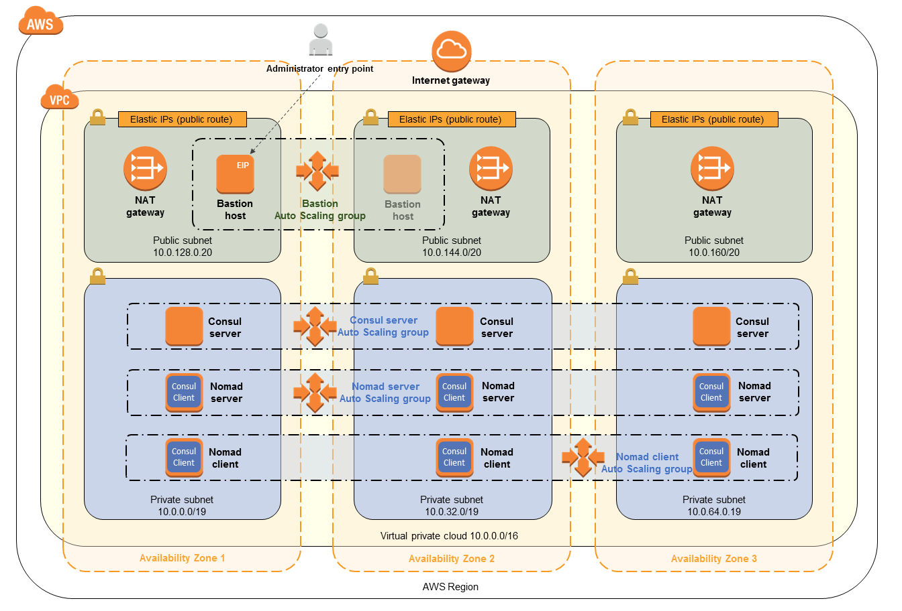

# Learn Nomad and Consul

[Nomad](https://www.nomadproject.io/) is a simple and flexible workload orchestrator to deploy and manage containers \
and non-containerized applications across on-prem and clouds at scale.

[Consul](https://www.consul.io/) is a service Mesh for any runtime or cloud. Consul automates networking for simple \
and secure application delivery.

## Prerequisites

- terraform
- ansible
- ssh keys
- packer (optional)

## How it works

### Required for running commands which require communication with AWS

0. Export or set your AWS profile

### Deploying the cluster

1. 
  1a. Create and fill out a `terraform.tfvars` in the `terraform/` dir (cross reference `variables.tf`, \
      it's advised to spin up 3 servers and at least 1 client). Also adjust the `locals.tf` to personalise the stack.

  1b. Also update `main.tf` (backend stanza doesn't allow you to use variables here) to point to your own s3 bucket \
      (to store terraform.tfstate)

2. In `terraform/` run `terraform init`

3. In ansible `chmod +x  ./init-agents.sh`

4. In the root dir of the the repo `chmod +x ./create-cluster.sh`

5. `./create-cluster.sh`

This will spin up a nomad and consul cluster, with the consul and nomad servers on the same instance. Consul is span \
up first and is responsible for service discorvery. Nomad then spins up and uses consul to find the other servers.

Without the autoscaling this is the infrastructure that is span up:

When it comes to specifying an ami, it is recommended to use packer to create a base image which contains the latest \
versions of nomad and consul. You can use a public ami however it contains quite old versions of nomad and consul \
baked in. Follow these steps to create your own base image (with your AWS credentials exported):

a. `cd packer`

b. `packer init .`

c. `packer build aws-ubuntu.pkr`

After the ec2 instances are span up, then terraform outputs to the server and clients public ips to `ansible.cfg` in \
the `ansible/` dir. Ansible configures the servers first with consul and then nomad (running them both as daemons).
Ansible then sets up the clients and installs docker so that we can run docker based jobs.

### Destroying the cluster

1. `cd terraform/`
2. `terraform destroy`

## Next steps

Deploy Fabio (a zero conf load balancer) and then deploy some containers! 

[Follow this tutorial](https://learn.hashicorp.com/tutorials/nomad/load-balancing-fabio?in=nomad/load-balancing)

## Todo

- [  ] - integrate consul connect
- [  ] - research ACL
- [  ] - research terraform tests
